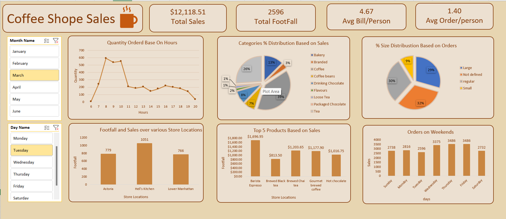

# ☕ Coffee Shop Sales - Excel Data Analysis Dashboard

This project presents an Excel-based interactive dashboard for analyzing sales data from a coffee shop chain. It helps uncover trends in sales, customer footfall, product performance, and more using powerful visualizations and slicers.

---

## 📌 Project Features

- 💰 **Total Sales Overview**  
- 👣 **Total Footfall & Average Order/Person**  
- ⏰ **Hourly Trends in Order Quantity**  
- 📦 **Product Category-wise Sales Distribution**  
- 📐 **Size-based Order Distribution (Small, Regular, Large)**  
- 🗺️ **Footfall by Store Location**  
- 🌟 **Top 5 Products Based on Sales**  
- 📅 **Daily & Weekend Order Trends**

---

## 📂 Files Included

- `coffee-shop-sales-dashboard.xlsx` – Excel file with all data visualizations  
- `coffee-shop-sales-dashboard.png` – Dashboard screenshot for preview  
- `README.md` – Project description and documentation

---

## 🛠 Tools Used

- Microsoft Excel  
- Pivot Tables  
- Slicers  
- Charts (Bar, Line, Pie)  
- Basic Excel formulas

---

## 📈 Use Case

This dashboard is ideal for:
- Retail analysts wanting to monitor store performance  
- Business managers evaluating product popularity  
- Beginners learning data visualization in Excel

---

## 🧠 Learnings

Through this project, I practiced:
- Cleaning and organizing raw sales data  
- Creating pivot tables and slicers for dynamic filtering  
- Designing an intuitive and professional Excel dashboard  
- Extracting actionable insights from business data

---

## 📸 Preview

---

## 📧 Contact

If you have any feedback, ideas, or questions, feel free to reach out through GitHub or connect with me on LinkedIn.

---
